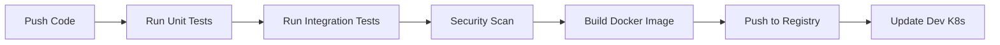

# Pipeline-of-Pipelines Platform

Production-grade CI/CD platform using GitHub Actions, ArgoCD, and Kubernetes with human verification gates.

## Architecture Overview

```
┌─────────────────────────────────────────────────────────────────────────────┐
│                              GITHUB REPOSITORY                              │
│  ┌─────────────────────────────────────────────────────────────────────────┐ │
│  │                         CODE CHANGES                                     │ │
│  │  • Developer pushes code → GitHub Actions CI                            │ │
│  │  • Tests run (unit, integration)                                        │ │
│  │  • Docker image built and pushed                                        │ │
│  └────────────────────────────────────────┬────────────────────────────────┘ │
│                                           │                                  │
│                                           ▼                                  │
│  ┌─────────────────────────────────────────────────────────────────────────┐ │
│  │                      HUMAN VERIFICATION GATES                            │ │
│  │                                                                         │ │
│  │   QA Review ──→ Stage Deploy ──→ QA Verify ──→ Prod Approval ──→ Deploy│ │
│  │       │            │              │              │           │           │ │
│  │       ▼            ▼              ▼              ▼           ▼           │ │
│  │   Comment     Auto-deploy     Comment      Manual       Auto-deploy     │ │
│  │   "LGTM"      to Stage        "Verified"   /approve     to Prod        │ │
│  │                                                                         │ │
│  └────────────────────────────────────────┬────────────────────────────────┘ │
│                                           │                                  │
│                                           ▼                                  │
│  ┌─────────────────────────────────────────────────────────────────────────┐ │
│  │                            ARGO CD (GitOps)                              │ │
│  │                                                                         │ │
│  │   Image Update → Git Commit → ArgoCD Sync → K8s Rollout                 │ │
│  │                                                                         │ │
│  └────────────────────────────────────────┬────────────────────────────────┘ │
│                                           │                                  │
│                                           ▼                                  │
│  ┌─────────────────────────────────────────────────────────────────────────┐ │
│  │                          KUBERNETES CLUSTERS                             │ │
│  │                                                                         │ │
│  │   ┌─────────────────┐    ┌─────────────────┐    ┌─────────────────┐    │ │
│  │   │    DEV          │    │    STAGE        │    │   PRODUCTION    │    │ │
│  │   │  Namespace:     │    │  Namespace:     │    │  Namespace:     │    │ │
│  │   │  app-dev        │    │  app-staging    │    │  app-prod       │    │ │
│  │   │  Replicas: 1    │    │  Replicas: 2    │    │  Replicas: 3+   │    │ │
│  │   └─────────────────┘    └─────────────────┘    └─────────────────┘    │ │
│  │                                                                         │ │
│  └─────────────────────────────────────────────────────────────────────────┘ │
└─────────────────────────────────────────────────────────────────────────────┘
```

## Repository Structure

```
pipeline-arch/
├── .github/
│   ├── workflows/
│   │   ├── ci.yml              # CI pipeline (test, build, scan)
│   │   ├── cd-dev.yml          # Dev deployment (auto)
│   │   ├── cd-stage.yml        # Stage deployment (auto)
│   │   └── cd-prod.yml         # Production deployment (manual approval)
│   └── pull_request_template.md
│
├── cmd/
│   └── server/
│       └── main.go             # Application entrypoint
│
├── internal/
│   ├── api/
│   │   ├── handlers.go         # HTTP handlers
│   │   ├── middleware.go       # Logging, recovery, metrics
│   │   └── routes.go           # Route definitions
│   ├── config/
│   │   └── config.go           # Configuration loading
│   ├── models/
│   │   └── user.go             # Data models
│   ├── repository/
│   │   └── user_repo.go        # Database operations
│   └── services/
│       └── user_service.go     # Business logic
│
├── pkg/
│   ├── logger/
│   │   └── logger.go           # Structured logging
│   ├── metrics/
│   │   └── metrics.go          # Prometheus metrics
│   └── errors/
│       └── errors.go           # Error handling
│
├── tests/
│   ├── unit/
│   │   ├── handlers_test.go
│   │   ├── services_test.go
│   │   └── repository_test.go
│   └── integration/
│       └── api_test.go         # Integration tests
│
├── Dockerfile                   # Multi-stage Docker build
├── .dockerignore
│
├── k8s/
│   ├── base/
│   │   ├── deployment.yaml
│   │   ├── service.yaml
│   │   ├── hpa.yaml
│   │   ├── pdb.yaml
│   │   ├── networkpolicy.yaml
│   │   ├── configmap.yaml
│   │   ├── secret.yaml
│   │   └── serviceaccount.yaml
│   │
│   ├── overlays/
│   │   ├── dev/
│   │   │   ├── kustomization.yaml
│   │   │   └── replica-patch.yaml
│   │   ├── staging/
│   │   │   ├── kustomization.yaml
│   │   │   └── replica-patch.yaml
│   │   └── prod/
│   │       ├── kustomization.yaml
│   │       ├── replica-patch.yaml
│   │       └── pdb-patch.yaml
│   │
│   └── kustomization.yaml
│
├── helm/
│   ├── app/
│   │   ├── Chart.yaml
│   │   ├── values.yaml
│   │   ├── values-dev.yaml
│   │   ├── values-staging.yaml
│   │   ├── values-prod.yaml
│   │   └── templates/
│   │       ├── deployment.yaml
│   │       ├── service.yaml
│   │       ├── hpa.yaml
│   │       ├── pdb.yaml
│   │       ├── networkpolicy.yaml
│   │       ├── configmap.yaml
│   │       ├── secret.yaml
│   │       └── _helpers.tpl
│   └── external-secrets/
│       └── externalsecret.yaml
│
├── scripts/
│   ├── build.sh                # Build script
│   ├── test.sh                 # Test script
│   ├── docker-build.sh         # Docker build script
│   └── deploy.sh               # Deployment script
│
├── .golangci.yml               # Linter configuration
├── .hadolint.yml               # Dockerfile linter config
├── go.mod
├── go.sum
├── Makefile
├── LICENSE
└── README.md
```

## Quick Start

### Prerequisites

- Go 1.21+
- Docker 24+
- kubectl configured
- Access to Kubernetes cluster
- ArgoCD installed

### Local Development

```bash
# Clone the repository
git clone https://github.com/YOUR_ORG/pipeline-arch.git
cd pipeline-arch

# Run locally
make run

# Run tests
make test

# Build Docker image
make docker-build
```

### Deploy to Kubernetes

```bash
# Deploy to Dev
kubectl apply -k k8s/overlays/dev

# Deploy to Staging
kubectl apply -k k8s/overlays/staging

# Deploy to Production (requires manual approval in GitHub)
# Use GitHub Actions workflow_dispatch
```

### Deploy with Helm

```bash
# Add helm repo (if published)
helm repo add pipeline-arch https://your-org.github.io/pipeline-arch

# Install to Staging
helm install app-staging pipeline-arch/app -f helm/app/values-staging.yaml

# Upgrade
helm upgrade app-staging pipeline-arch/app -f helm/app/values-staging.yaml
```

## Environment Variables

| Variable | Description | Default | Required |
|----------|-------------|---------|----------|
| `APP_HOST` | Server host | `0.0.0.0` | No |
| `APP_PORT` | Server port | `8080` | No |
| `DATABASE_URL` | PostgreSQL connection string | `` | Yes |
| `REDIS_URL` | Redis connection string | `` | No |
| `LOG_LEVEL` | Logging level | `info` | No |
| `METRICS_PORT` | Metrics server port | `9090` | No |

## CI/CD Pipeline Flow

### 1. CI Pipeline (`.github/workflows/ci.yml`)



**Triggers:**
- Push to `main` branch
- Pull Request to `main`

**Steps:**
1. Checkout code
2. Run Go tests (unit + integration)
3. Run linters (golangci-lint, hadolint)
4. Security scan (Trivy, Gitleaks)
5. Build and push Docker image
6. Update image tag in GitOps repo
7. Auto-deploy to Dev environment

### 2. CD Pipeline (`.github/workflows/cd-*.yml`)

| Environment | Trigger | Approval Required |
|-------------|---------|-------------------|
| Dev | Auto on CI success | No |
| Staging | Auto on Dev verified | No (auto after LGTM comment) |
| Production | Manual workflow_dispatch | Yes (required) |

### 3. Human Verification Gates

#### QA Verification (Stage → Prod)

Comment on PR:
- **`/verify-stage`** - Trigger stage deployment verification
- **`/lgtm`** - Approve for production
- **`/rollback`** - Rollback last deployment

#### Production Approval

Production deployment requires:
1. PR with changes
2. CI pipeline passed
3. Dev deployment successful
4. Staging deployment successful + verified
5. **Manual approval** in GitHub Actions

### 4. ArgoCD Sync

ArgoCD continuously monitors the GitOps repo:

```yaml
# ApplicationSet creates apps for each environment
apiVersion: argoproj.io/v1alpha1
kind: ApplicationSet
metadata:
  name: pipeline-arch
spec:
  generators:
    - matrix:
        generators:
          - list:
              elements:
                - env: dev
                - env: staging
                - env: prod
  template:
    spec:
      destination:
        namespace: app-{{env}}
```

## Monitoring

### Metrics

The application exposes Prometheus metrics at `/metrics`:

- `http_requests_total` - Total HTTP requests
- `http_request_duration_seconds` - Request latency
- `app_users_total` - User count
- `app_operations_total` - Operation counts by type

### Health Endpoints

- `/healthz` - Liveness probe
- `/readyz` - Readiness probe
- `/metrics` - Prometheus metrics

### Dashboards

Grafana dashboards available in `grafana/` directory:
- `pipeline-arch-overview.json` - Overview dashboard
- `pipeline-arch-performance.json` - Performance metrics

## Security

### Container Security

- Distroless base image
- Non-root user execution
- Read-only filesystem
- Resource limits
- Security context configured

### Network Security

- NetworkPolicy restricting traffic
- Ingress with TLS
- Service account with minimal RBAC

### Secrets Management

- External Secrets Operator
- GitHub Actions secrets
- Rotation policies

## Contributing

1. Fork the repository
2. Create a feature branch (`git checkout -b feature/amazing-feature`)
3. Commit changes (`git commit -m 'Add amazing feature'`)
4. Push to branch (`git push origin feature/amazing-feature`)
5. Open a Pull Request

### Code Style

- Follow Go conventions (Effective Go, CodeReviewComments)
- Run linters before committing (`make lint`)
- Write tests for new functionality
- Update documentation as needed

## License

This project is licensed under the MIT License - see the [LICENSE](LICENSE) file for details.

## Support

- Create an issue for bugs
- Discussions for questions
- Wiki for documentation